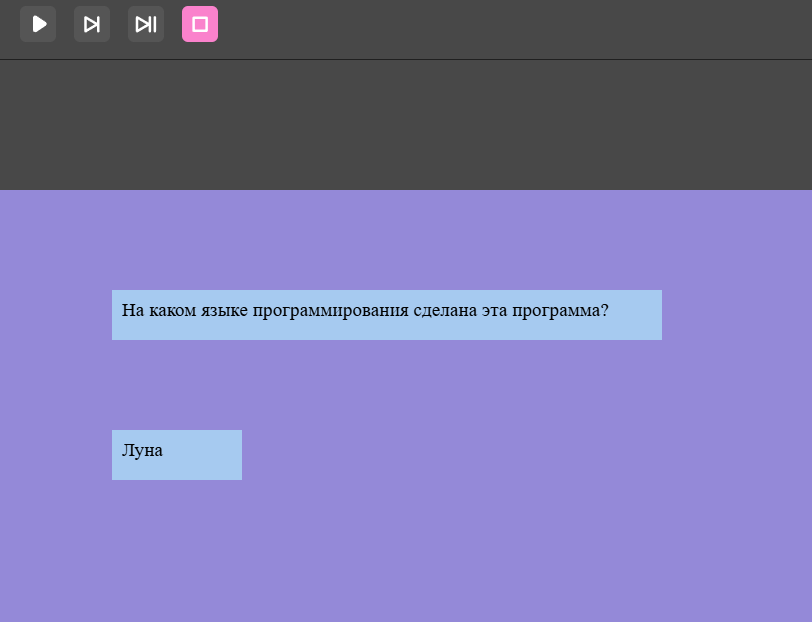

# pygame
Опыт работы с pygame
## Работа с программой
Q - Question, высветится случайный вопрос.
A - Answer, высветится случайный ответ к какому-либо из вопросов (всего 3 вопроса и 3 ответа).
## Пример работы программы:

